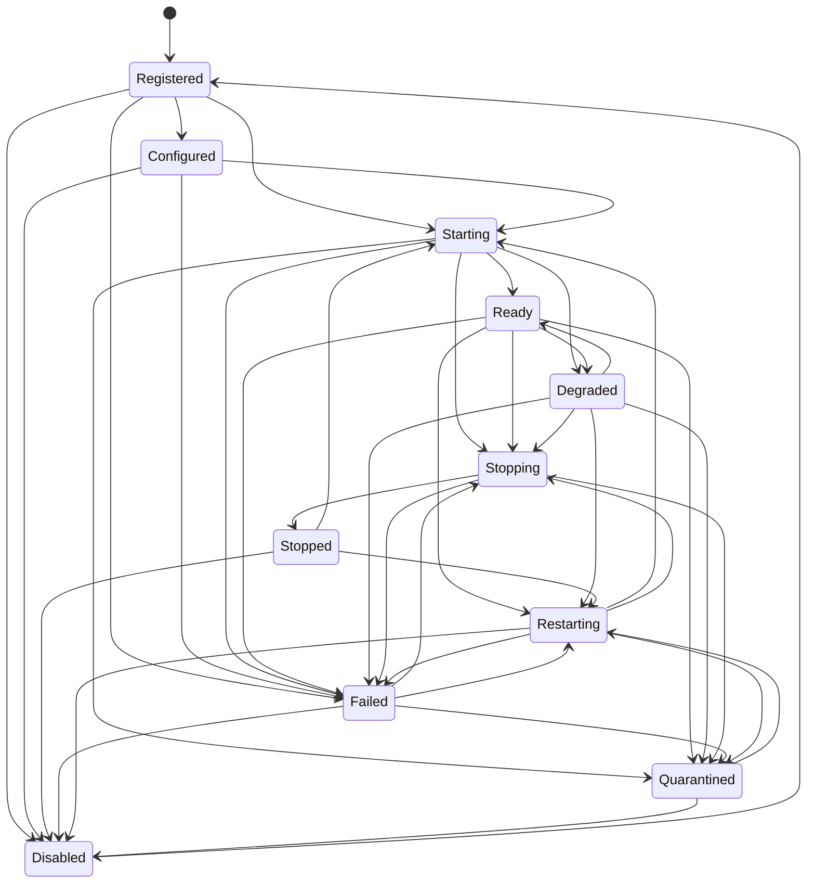

# FND-012 Service Lifecycle State Machine

**Owner:** Runtime Kernel

**Authoritative policy:** `RuntimeServiceLifecycleContractPolicy`

**Result:** Passed

The Runtime Kernel serialises lifecycle operations, starts declared dependencies
before dependants, and stops dependants before their dependencies. Required
dependency failure prevents readiness; optional dependency failure produces a
visible Degraded projection. Startup and shutdown hooks have bounded deadlines,
with stable failure categories and codes projected through the Service Registry.

The transition sequence is authoritative only for the current Runtime boot. On a
new boot, the Runtime reconstructs Registered or Disabled state from trusted
service definitions and then re-runs dependency and lifecycle checks; it does not
persist or trust a stale Ready projection.

Publication of `service.state-changed` into Trust Evidence remains deliberately
deferred until the Trust Evidence service exists. Process termination and restart
budgets remain owned by the Process Supervisor.
