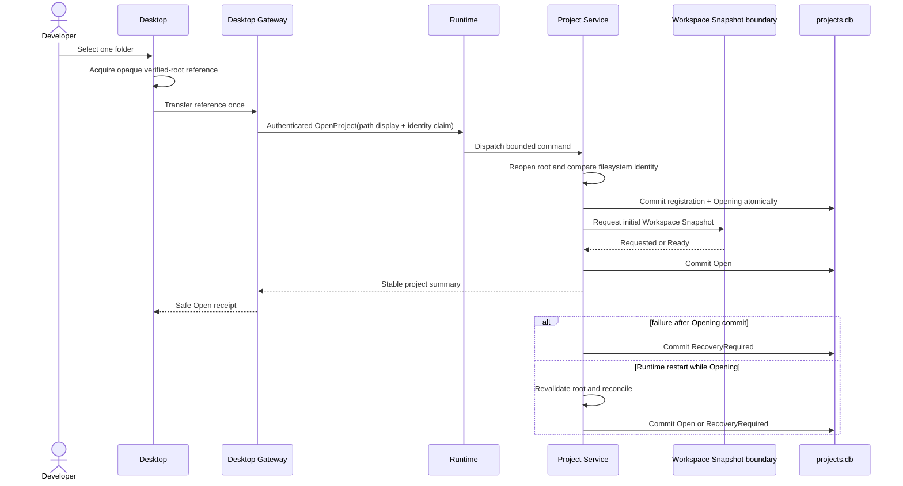

# FND-029 Open Project sequence

This evidence describes the implemented owner and recovery boundaries. Project
Service is authoritative. Desktop and Desktop Gateway retain no database object
or verified-root capability after the bounded command returns.

The initial Workspace Snapshot requester is a future-stable boundary. In this
foundation slice it records `Requested`; later Workspace Service work may
replace the adapter without changing the Open Project wire contract.
